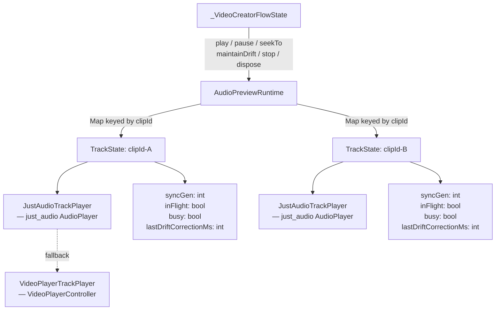
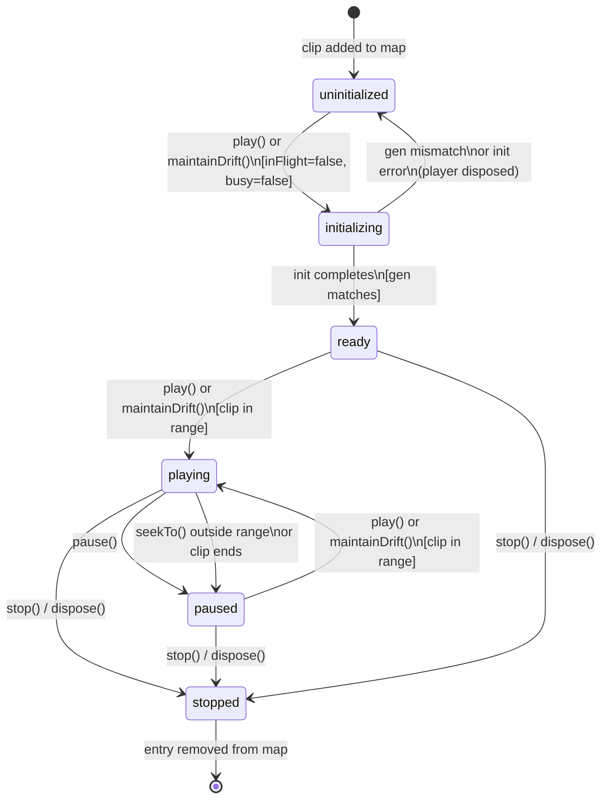

# Design Document: AudioPreviewRuntime

## Overview

`AudioPreviewRuntime` is a new Dart class that encapsulates all audio preview state and logic currently scattered as five flat fields in `_VideoCreatorFlowState`. It replaces `VideoPlayerController` with `just_audio`'s `AudioPlayer` for audio-only playback, reducing startup latency from ~100–500 ms to ~10–50 ms and eliminating the video-pipeline overhead that made the existing race condition easy to trigger.

The runtime manages a `Map<String, TrackState>` keyed by clip ID, giving each track its own player, sync-gen counter, in-flight flag, and busy flag. This architecture directly enables multi-track simultaneous playback (background music + voiceover), volume ducking, and per-track effects — all without touching the UI layer.

**Key design decisions:**

- **`just_audio` over `VideoPlayerController`**: Audio-only player with ~10–50 ms startup vs ~100–500 ms. Precise seeking. No video surface allocation. Preferred when available.
- **`VideoPlayerController` fallback**: Preserved for environments where `just_audio` cannot be added, keeping all existing behaviour.
- **Per-track gen counters**: Stopping one track never invalidates another track's in-flight initialisation.
- **Abstract `TrackPlayer` interface**: Allows `JustAudioTrackPlayer` and `VideoPlayerTrackPlayer` to be swapped without changing `AudioPreviewRuntime` logic, and enables mock injection in tests.
- **`_disposed` guard**: All public methods silently no-op after `dispose()`, preventing crashes from async callbacks completing after widget teardown.

---

## Architecture

### Component Diagram



### State Machine — Single Track

Each track independently transitions through these states:



### How `maintainDrift` Interacts with the Per-Track State Machine

`maintainDrift` is called on every video player tick (~16 ms). For each clip in the provided list it:

1. Checks `busy` — if `true`, skips the clip entirely (reentrancy guard).
2. Sets `busy = true` in a `try/finally`.
3. If the player is `uninitialized` and `inFlight == false` → triggers initialisation (transitions to `initializing`).
4. If the player is `initializing` (`inFlight == true`) → skips without starting a second init.
5. If the player is `ready` but not playing → calls `play()` (transitions to `playing`).
6. If the player is `playing` → checks drift; if `|actual - expected| > DriftThreshold` and cooldown elapsed → seeks.
7. **Never increments `syncGen`** — that is exclusively the responsibility of `stop()` and `dispose()`.

---

## Components and Interfaces

### `TrackPlayer` — Abstract Interface

```dart
/// Abstraction over just_audio AudioPlayer and VideoPlayerController.
/// Allows AudioPreviewRuntime to be backend-agnostic and fully testable
/// via mock injection.
abstract interface class TrackPlayer {
  /// Initialise the player for the given file path.
  /// Returns the media duration on success.
  /// Throws on failure — caller is responsible for disposal.
  Future<Duration> initialize(String filePath);

  /// Seek to [positionMs] without starting playback.
  Future<void> seekTo(int positionMs);

  /// Start or resume playback.
  Future<void> play();

  /// Pause playback without disposing the player.
  Future<void> pause();

  /// Set the playback volume (0.0–1.0).
  Future<void> setVolume(double volume);

  /// Current playback position in milliseconds.
  int get positionMs;

  /// Whether the player is currently playing.
  bool get isPlaying;

  /// Release all resources. Must be called exactly once.
  Future<void> dispose();
}
```

### `JustAudioTrackPlayer` — `just_audio` Implementation

```dart
/// TrackPlayer backed by just_audio AudioPlayer.
/// Fast startup (~10–50 ms), precise seeking, no video surface overhead.
final class JustAudioTrackPlayer implements TrackPlayer {
  final AudioPlayer _player = AudioPlayer();

  @override
  Future<Duration> initialize(String filePath) async {
    final duration = await _player.setFilePath(filePath);
    return duration ?? Duration.zero;
  }

  @override
  Future<void> seekTo(int positionMs) =>
      _player.seek(Duration(milliseconds: positionMs));

  @override
  Future<void> play() => _player.play();

  @override
  Future<void> pause() => _player.pause();

  @override
  Future<void> setVolume(double volume) async => _player.setVolume(volume);

  @override
  int get positionMs =>
      _player.position.inMilliseconds;

  @override
  bool get isPlaying => _player.playing;

  @override
  Future<void> dispose() => _player.dispose();
}
```

### `VideoPlayerTrackPlayer` — Fallback Implementation

```dart
/// TrackPlayer backed by VideoPlayerController.
/// Used when just_audio is not available. Preserves all existing behaviour.
final class VideoPlayerTrackPlayer implements TrackPlayer {
  VideoPlayerController? _controller;

  @override
  Future<Duration> initialize(String filePath) async {
    _controller = VideoPlayerController.file(File(filePath));
    await _controller!.initialize();
    return _controller!.value.duration;
  }

  @override
  Future<void> seekTo(int positionMs) =>
      _controller!.seekTo(Duration(milliseconds: positionMs));

  @override
  Future<void> play() => _controller!.play();

  @override
  Future<void> pause() => _controller!.pause();

  @override
  Future<void> setVolume(double volume) => _controller!.setVolume(volume);

  @override
  int get positionMs =>
      _controller?.value.position.inMilliseconds ?? 0;

  @override
  bool get isPlaying => _controller?.value.isPlaying ?? false;

  @override
  Future<void> dispose() async {
    await _controller?.pause();
    await _controller?.dispose();
    _controller = null;
  }
}
```

---

## Data Models

### `TrackState`

All per-track bookkeeping is held in a single `TrackState` object. This is an internal implementation detail — it is never exposed through the public API.

```dart
/// Internal per-track state held in AudioPreviewRuntime._tracks.
final class TrackState {
  /// The underlying audio player for this track.
  final TrackPlayer player;

  /// Generation counter. Incremented by stop()/dispose() to invalidate
  /// any in-flight initialisation for this track.
  int syncGen;

  /// True if and only if this track's initialisation coroutine is currently
  /// executing. Set before the async init call; cleared in a finally block.
  bool inFlight;

  /// Reentrancy guard. True while any start or drift-correction operation
  /// is executing for this track. Set before entering; cleared in finally.
  bool busy;

  /// Epoch-ms timestamp of the last corrective seek for this track.
  /// Used to enforce DriftCooldown between consecutive seeks.
  int lastDriftCorrectionMs;

  TrackState({
    required this.player,
    this.syncGen = 0,
    this.inFlight = false,
    this.busy = false,
    this.lastDriftCorrectionMs = 0,
  });
}
```

### `AudioTimelineClip` (existing, referenced for clarity)

The runtime consumes `AudioTimelineClip` objects from `TimelineController`. Relevant fields:

| Field | Type | Meaning |
|---|---|---|
| `id` | `String` | Unique clip identifier — key in `_tracks` map |
| `sourcePath` | `String` | Absolute path to the audio file |
| `sourceStartMs` | `int` | Start offset within the source file |
| `sourceEndMs` | `int` | End offset within the source file |
| `timelineStartMs` | `int` | Position on the master timeline where this clip begins |
| `timelineEndMs` | `int` | Position on the master timeline where this clip ends |
| `durationMs` | `int` | `timelineEndMs - timelineStartMs` |
| `volume` | `double` | Playback volume (0.0–1.0) |
| `muted` | `bool` | If true, volume is forced to 0.0 |

### Position Formula

The expected source position for a clip at a given timeline position:

```
sourcePos = clip.sourceStartMs + (timelineMs - clip.timelineStartMs)
```

Inverse (timeline position from source position):

```
timelineMs = clip.timelineStartMs + (sourcePos - clip.sourceStartMs)
```

These two formulas are exact inverses — the round-trip `timelineMs → sourcePos → timelineMs` is identity for all valid inputs (see Correctness Property 4).

---

## Low-Level Design

### `AudioPreviewRuntime` — Full Class Skeleton

```dart
/// Manages one or more audio track players for timeline preview.
///
/// Owns the lifecycle of all TrackPlayer instances, per-track sync-gen
/// counters, in-flight flags, and drift correction. Exposes a clean
/// play/pause/seekTo/maintainDrift/stop/dispose interface to
/// _VideoCreatorFlowState.
///
/// Thread safety: all methods must be called from the Flutter UI isolate.
final class AudioPreviewRuntime {
  static const int _driftThresholdMs = 1000;
  static const int _driftCooldownMs  = 900;

  /// Factory for creating TrackPlayer instances. Injected for testing.
  final TrackPlayer Function() _playerFactory;

  /// Per-track state, keyed by clip ID.
  final Map<String, TrackState> _tracks = {};

  /// Set to true by dispose(). All public methods silently no-op when true.
  bool _disposed = false;

  /// Whether volume ducking is enabled.
  final bool duckingEnabled;

  AudioPreviewRuntime({
    TrackPlayer Function()? playerFactory,
    this.duckingEnabled = false,
  }) : _playerFactory = playerFactory ?? (() => JustAudioTrackPlayer());

  // ── Public API ────────────────────────────────────────────────────────────

  /// Start or resume all non-muted clips whose time range contains [timelineMs].
  /// Stops and disposes players for clips no longer in [clips] or now muted.
  Future<void> play(int timelineMs, List<AudioTimelineClip> clips) async { ... }

  /// Pause all active TrackPlayers without disposing them or incrementing SyncGen.
  Future<void> pause() async { ... }

  /// Seek all initialised TrackPlayers to the correct source position
  /// without starting playback.
  Future<void> seekTo(int timelineMs, List<AudioTimelineClip> clips) async { ... }

  /// Called on every video player tick. Corrects A/V drift and starts
  /// players for clips that are not yet initialised.
  /// MUST NOT increment any SyncGen counter.
  Future<void> maintainDrift(int timelineMs, List<AudioTimelineClip> clips) async { ... }

  /// Halt all tracks, increment all SyncGen counters, dispose all players,
  /// and clear the internal map.
  Future<void> stop() async { ... }

  /// Release all resources. Sets _disposed=true so subsequent async
  /// completions are silently ignored.
  Future<void> dispose() async { ... }

  // ── Internal helpers ──────────────────────────────────────────────────────

  /// Initialise a TrackPlayer for [clip] if not already initialised.
  /// Sets inFlight=true before the async call; clears it in finally.
  /// On gen mismatch or error: disposes the player and removes the entry.
  Future<void> _ensurePlayer(String clipId, AudioTimelineClip clip, int capturedGen) async { ... }

  /// Compute expected source position for [clip] at [timelineMs].
  /// Returns null if timelineMs is outside the clip's range.
  int? _expectedSourceMs(AudioTimelineClip clip, int timelineMs) { ... }

  /// Apply volume ducking: if a voiceover clip is playing, reduce all
  /// non-voiceover volumes to clip.volume * 0.3.
  Future<void> _applyVolumes(List<AudioTimelineClip> clips) async { ... }
}
```

### Method Pseudocode

#### `play(timelineMs, clips)`

```
if _disposed: return
activeIds = {clip.id for clip in clips if !clip.muted and clip contains timelineMs}

// Stop players for clips no longer active
for (id, state) in _tracks where id not in activeIds:
  state.syncGen++
  await state.player.pause()
  await state.player.dispose()
  _tracks.remove(id)

// Start or resume active clips
for clip in clips where clip.id in activeIds:
  if _tracks[clip.id] does not exist:
    _tracks[clip.id] = TrackState(player: _playerFactory())
  state = _tracks[clip.id]
  if state.busy: continue
  state.busy = true
  try:
    capturedGen = state.syncGen
    if not player.isInitialized:
      if state.inFlight: continue
      await _ensurePlayer(clip.id, clip, capturedGen)
      if capturedGen != state.syncGen: continue
    sourceMs = _expectedSourceMs(clip, timelineMs)
    if sourceMs == null: await state.player.pause(); continue
    await state.player.seekTo(sourceMs)
    if capturedGen != state.syncGen: continue
    await state.player.setVolume(clip.muted ? 0.0 : clip.volume)
    await state.player.play()
  finally:
    state.busy = false
await _applyVolumes(clips)
```

#### `pause()`

```
if _disposed: return
for state in _tracks.values:
  // Do NOT increment syncGen — pause is reversible
  try: await state.player.pause()
  catch e: log(e)
```

#### `seekTo(timelineMs, clips)`

```
if _disposed: return
for clip in clips:
  state = _tracks[clip.id]
  if state == null: continue
  sourceMs = _expectedSourceMs(clip, timelineMs)
  try:
    if sourceMs == null:
      await state.player.pause()
    else:
      await state.player.seekTo(sourceMs)
      // Do NOT call play() — seekTo is silent
  catch e: log(e)
```

#### `maintainDrift(timelineMs, clips)`

```
if _disposed: return
// INVARIANT: syncGen is NEVER incremented in this method or any callee
for clip in clips where !clip.muted:
  state = _tracks[clip.id]
  if state == null:
    _tracks[clip.id] = TrackState(player: _playerFactory())
    state = _tracks[clip.id]
  if state.busy: continue
  state.busy = true
  try:
    if state.inFlight: continue  // init already in progress — do not double-init
    capturedGen = state.syncGen
    if not player.isInitialized:
      await _ensurePlayer(clip.id, clip, capturedGen)
      if capturedGen != state.syncGen: continue
    sourceMs = _expectedSourceMs(clip, timelineMs)
    if sourceMs == null:
      if state.player.isPlaying: await state.player.pause()
      continue
    if not state.player.isPlaying:
      await state.player.seekTo(sourceMs)
      await state.player.setVolume(clip.muted ? 0.0 : clip.volume)
      await state.player.play()
      continue
    // Drift correction
    actualMs = state.player.positionMs
    drift = |actualMs - sourceMs|
    if drift >= _driftThresholdMs:
      now = DateTime.now().millisecondsSinceEpoch
      if now - state.lastDriftCorrectionMs >= _driftCooldownMs:
        state.lastDriftCorrectionMs = now
        await state.player.seekTo(sourceMs)
        if capturedGen != state.syncGen: continue
        if not state.player.isPlaying: await state.player.play()
  catch e: log(e)
  finally:
    state.busy = false
await _applyVolumes(clips)
```

#### `stop()`

```
if _disposed: return
for (id, state) in _tracks:
  state.syncGen++  // invalidate any in-flight init
  try:
    await state.player.pause()
    await state.player.dispose()
  catch e: log(e)  // continue disposing remaining players
_tracks.clear()
```

#### `dispose()`

```
await stop()
_disposed = true
```

#### `_ensurePlayer(clipId, clip, capturedGen)`

```
state = _tracks[clipId]
if state == null: return
state.inFlight = true
try:
  await state.player.initialize(clip.sourcePath)
  if capturedGen != state.syncGen:
    // Stale — stop() was called while we were initialising
    await state.player.dispose()
    _tracks.remove(clipId)
    return
  // Player is now ready; caller will seek and play
catch e:
  log('[AudioPreviewRuntime] init failed for $clipId: $e')
  try: await state.player.dispose() catch _: {}
  _tracks.remove(clipId)
finally:
  if _tracks[clipId] != null:
    _tracks[clipId]!.inFlight = false
```

### `_VideoCreatorFlowState` Diff — Call Sites

#### Fields (before → after)

```dart
// BEFORE
VideoPlayerController? _audioPreview;
int _audioPreviewSyncGen = 0;
int _lastAudioDriftCorrectionMs = 0;
bool _audioPreviewBusy = false;
bool _audioStartInFlight = false;

// AFTER
final AudioPreviewRuntime _audioRuntime = AudioPreviewRuntime();
```

#### `dispose()` (before → after)

```dart
// BEFORE
unawaited(_stopAudioPreview());

// AFTER
unawaited(_audioRuntime.dispose());
```

#### `_togglePlayback()` — play branch (before → after)

```dart
// BEFORE
await player.play();
await _startAudioPreview();

// AFTER
await player.play();
await _audioRuntime.play(_playheadTimelineMs, _timeline.audioClips);
```

#### `_togglePlayback()` — pause branch (before → after)

```dart
// BEFORE
player.pause();
await _stopAudioPreview();

// AFTER
player.pause();
await _audioRuntime.stop();
```

#### `_onPlayerUpdated()` — drift maintenance (before → after)

```dart
// BEFORE
unawaited(_maintainAudioPreviewDrift());

// AFTER
unawaited(_audioRuntime.maintainDrift(_playheadTimelineMs, _timeline.audioClips));
```

#### `_advancePastClipEndIfNeeded()` — clip jump (before → after)

```dart
// BEFORE
await player.play();
await _startAudioPreview();

// AFTER
await player.play();
await _audioRuntime.play(next.timelineStartMs, _timeline.audioClips);
```

#### `_onTimelineUpdated()` — volume/mute change (before → after)

```dart
// BEFORE
if (preview != null && preview.value.isInitialized) {
  final selected = _timeline.selectedAudioClipId;
  for (final clip in _timeline.audioClips) {
    if (clip.id == selected && _isSamePath(preview.dataSource, clip.sourcePath)) {
      unawaited(preview.setVolume(clip.muted ? 0 : clip.volume));
      break;
    }
  }
}

// AFTER
if (_player?.isPlaying ?? false) {
  unawaited(_audioRuntime.maintainDrift(_playheadTimelineMs, _timeline.audioClips));
}
```

#### Scrubbing while paused — `_schedulePreviewSync()` (before → after)

```dart
// BEFORE
// (no audio seek on scrub — audio was only repositioned on play)

// AFTER
// In _schedulePreviewSync, after _applySeekFromTimelineMs:
unawaited(_audioRuntime.seekTo((timelineSeconds * 1000).round(), _timeline.audioClips));
```

#### `_exportVideo()` — stop before export (before → after)

```dart
// BEFORE
await _stopAudioPreview();

// AFTER
await _audioRuntime.stop();
```

#### Methods removed from `_VideoCreatorFlowState`

The following private methods are deleted entirely — their logic lives in `AudioPreviewRuntime`:

- `_stopAudioPreview()`
- `_startAudioPreview()`
- `_startAudioPreviewInner()`
- `_maintainAudioPreviewDrift()`
- `_maintainAudioPreviewDriftInner()`
- `_ensureAudioPreviewController()`
- `_activeAudioPreviewTrack()`
- `_expectedAudioPositionMs()`

---

## Correctness Properties

*A property is a characteristic or behavior that should hold true across all valid executions of a system — essentially, a formal statement about what the system should do. Properties serve as the bridge between human-readable specifications and machine-verifiable correctness guarantees.*

The prework analysis identified the following testable properties from the requirements. After reflection, several redundant properties were consolidated:

- Requirements 3.1, 3.3, 3.4, 6.2, 6.3 all relate to "play reaches player.play() when conditions are met and in-flight guard prevents double-init" → consolidated into **Property 1**.
- Requirements 6.6 and 9.1 both state that `syncGen` is only incremented by `stop`/`dispose` → consolidated into **Property 2**.
- Requirements 9.4 and 9.5 both describe flag accuracy (inFlight and busy) → consolidated into **Property 3**.
- Requirements 14.1–14.5 all describe the position formula and its invertibility → consolidated into **Property 4**.
- Requirements 3.4 and 9.5 (at-most-one-init) are a consequence of Property 1 and Property 3 → kept as **Property 5** for explicit traceability.

### Property 1: `play` always reaches `player.play()` when conditions are met

*For any* `AudioPreviewRuntime` with a mock `TrackPlayer` factory, any list of `AudioTimelineClip` values, and any `timelineMs` within the range of at least one non-muted clip: calling `play(timelineMs, clips)` SHALL eventually call `player.play()` on the `TrackPlayer` for each such clip, regardless of how many concurrent `maintainDrift` calls are in progress.

Specifically: `maintainDrift` calls that observe `inFlight == true` for a clip MUST skip that clip without starting a second initialisation, and the original `play` call MUST complete and call `player.play()`.

**Validates: Requirements 3.1, 3.3, 3.4, 6.2, 6.3**

### Property 2: `syncGen` is only incremented by `stop` and `dispose`, never by `maintainDrift`

*For any* `AudioPreviewRuntime` with N active tracks, calling `maintainDrift(timelineMs, clips)` any number of times with any inputs SHALL leave all `syncGen` counters unchanged. Only `stop()` and `dispose()` may increment `syncGen` counters, and only for the tracks they are stopping — stopping track A MUST NOT change the `syncGen` of track B.

**Validates: Requirements 6.6, 9.1, 9.3**

### Property 3: `inFlight` and `busy` flags accurately reflect execution state

*For any* `TrackPlayer` initialisation (including ones that throw), `inFlight` SHALL be `true` if and only if the initialisation coroutine is currently executing. It SHALL be `false` before the call begins and SHALL be `false` after the call completes or fails (cleared in `finally`). The same invariant holds for `busy` across all start and drift-correction operations: `busy` SHALL be `true` if and only if a start or drift-correction operation is currently executing for that track.

**Validates: Requirements 9.4, 9.5**

### Property 4: Round-trip position formula is invertible

*For any* `AudioTimelineClip` and any `timelineMs` in the range `[clip.timelineStartMs, clip.timelineEndMs)`, the position formula `sourcePos = clip.sourceStartMs + (timelineMs - clip.timelineStartMs)` SHALL satisfy:

1. `clip.sourceStartMs <= sourcePos < clip.sourceEndMs` (bounds invariant)
2. `clip.timelineStartMs + (sourcePos - clip.sourceStartMs) == timelineMs` (round-trip identity)
3. When `timelineMs == clip.timelineStartMs`, `sourcePos == clip.sourceStartMs`
4. When `timelineMs == clip.timelineEndMs - 1`, `sourcePos == clip.sourceEndMs - 1`

**Validates: Requirements 14.1, 14.2, 14.3, 14.4, 14.5**

### Property 5: At most one initialisation per clip ID in flight at any time

*For any* clip ID, at any point in time, at most one call to `_ensurePlayer` SHALL be executing for that clip ID. This is guaranteed by `inFlight` being set to `true` before the async init call and cleared in `finally`, combined with all entry points checking `inFlight` before proceeding.

Equivalently: if `play(timelineMs, clips)` is called while `maintainDrift` is concurrently processing the same clip, the total number of `player.initialize()` calls for that clip SHALL be exactly 1.

**Validates: Requirements 3.4, 9.4, 9.5**

---

## Error Handling

### Initialisation failure

`_ensurePlayer` wraps `player.initialize()` in a `try/catch`. On any exception:
1. Logs the error with clip ID and message.
2. Calls `player.dispose()` (swallowing any secondary exception).
3. Removes the entry from `_tracks`.
4. Clears `inFlight` in `finally`.

The caller sees a missing entry in `_tracks` and treats the clip as uninitialized on the next `maintainDrift` tick, which will retry initialisation.

### Seek / play failure

`maintainDrift` and `play` wrap per-track seek/play calls in `try/catch`. On any exception:
1. Logs the error with clip ID.
2. Continues processing the remaining tracks.
3. Clears `busy` in `finally`.

### Disposal failure during `stop()`

`stop()` iterates all tracks and wraps each `player.dispose()` in `try/catch`. On any exception:
1. Logs the error.
2. Continues to the next track.
3. Clears the map after all disposal attempts.

### Post-dispose calls

`_disposed = true` is set at the end of `dispose()`. All public methods check this flag at entry and return immediately if set. This prevents crashes from async callbacks (e.g. a `maintainDrift` call that was `unawaited` before `dispose()` was called) completing after the widget is torn down.

### Gen mismatch

When `stop()` or `dispose()` increments `syncGen` while `_ensurePlayer` is awaiting `player.initialize()`, the gen-check `capturedGen != state.syncGen` fires after `initialize()` returns. The newly initialised player is disposed immediately and `play()` is never called. This is the primary mechanism that prevents zombie players after rapid play/stop sequences.

---

## Testing Strategy

### Dependency to add first

Before any tests can run, add `just_audio` to `examples/media_studio/pubspec.yaml`:

```yaml
dependencies:
  just_audio: ^0.9.40
```

### Dual Testing Approach

**Unit tests** cover specific examples, edge cases, and error conditions using mock `TrackPlayer` instances injected via the `playerFactory` constructor parameter.

**Property-based tests** verify the five correctness properties across many generated inputs. The property-based testing library for Dart is [`propcheck`](https://pub.dev/packages/propcheck) or [`dart_test_with_data`](https://pub.dev/packages/test). Given the Dart ecosystem, **`propcheck`** is the recommended choice — it provides generators for primitives and collections and integrates with `package:test`.

Each property test runs a minimum of **100 iterations**.

Tag format for each property test:
```dart
// Feature: audio-preview-runtime, Property N: <property_text>
```

### Unit Tests

Located at `examples/media_studio/test/services/audio_preview_runtime_test.dart`.

**Mock setup:**

```dart
class MockTrackPlayer implements TrackPlayer {
  int initializeCallCount = 0;
  int playCallCount = 0;
  int pauseCallCount = 0;
  int seekCallCount = 0;
  int lastSeekMs = 0;
  double lastVolume = 1.0;
  bool _isPlaying = false;
  int _positionMs = 0;
  bool shouldThrowOnInit = false;
  bool shouldThrowOnDispose = false;
  Duration initDelay = Duration.zero;

  @override
  Future<Duration> initialize(String filePath) async {
    await Future.delayed(initDelay);
    if (shouldThrowOnInit) throw Exception('mock init failure');
    initializeCallCount++;
    return const Duration(seconds: 60);
  }
  // ... other methods
}
```

**Key unit test cases:**

- `play()` with no clips → no players created, no crash
- `play()` with muted clip → player created but volume set to 0.0
- `play()` with clip outside timelineMs range → no player started
- `pause()` with no active players → no crash
- `stop()` with no active players → no crash
- `stop()` with throwing `dispose()` → remaining players still disposed
- `dispose()` followed by `play()` → silently ignored
- `maintainDrift()` with drift < threshold → no seek
- `maintainDrift()` with drift > threshold but within cooldown → no seek
- `maintainDrift()` with drift > threshold and cooldown elapsed → seek called
- Initialisation failure → entry removed from map, no crash
- Gen mismatch → `play()` not called on stale player

### Property-Based Tests

Located at `examples/media_studio/test/services/audio_preview_runtime_property_test.dart`.

**Generators needed:**

```dart
// Generate a valid AudioTimelineClip
Arbitrary<AudioTimelineClip> arbitraryClip() => ...

// Generate a list of non-overlapping clips
Arbitrary<List<AudioTimelineClip>> arbitraryClipList() => ...

// Generate a timelineMs within a clip's range
Arbitrary<int> arbitraryTimelineMs(AudioTimelineClip clip) => ...
```

**Property test implementations:**

```dart
// Feature: audio-preview-runtime, Property 1: play always reaches player.play() when conditions are met
test('play reaches player.play() for every in-range non-muted clip', () {
  forAll(arbitraryClipList(), (clips) {
    final factory = MockTrackPlayerFactory();
    final runtime = AudioPreviewRuntime(playerFactory: factory.create);
    final timelineMs = clips.first.timelineStartMs + 1;
    await runtime.play(timelineMs, clips);
    for (final clip in clips.where((c) => !c.muted && c.contains(timelineMs))) {
      expect(factory.playerFor(clip.id).playCallCount, greaterThan(0));
    }
  });
}, count: 100);

// Feature: audio-preview-runtime, Property 2: syncGen only incremented by stop/dispose
test('maintainDrift never increments syncGen', () {
  forAll(arbitraryClipList(), (clips) async {
    final runtime = AudioPreviewRuntime(playerFactory: () => MockTrackPlayer());
    await runtime.play(clips.first.timelineStartMs, clips);
    final gensBefore = runtime.debugSyncGens(); // test-only accessor
    for (var i = 0; i < 50; i++) {
      await runtime.maintainDrift(clips.first.timelineStartMs + i * 16, clips);
    }
    expect(runtime.debugSyncGens(), equals(gensBefore));
  });
}, count: 100);

// Feature: audio-preview-runtime, Property 3: inFlight and busy flags accurate
test('inFlight is false after initialization completes or fails', () {
  forAll(arbitraryClip(), (clip) async {
    final player = MockTrackPlayer(initDelay: const Duration(milliseconds: 10));
    final runtime = AudioPreviewRuntime(playerFactory: () => player);
    await runtime.play(clip.timelineStartMs, [clip]);
    expect(runtime.debugInFlight(clip.id), isFalse);
    expect(runtime.debugBusy(clip.id), isFalse);
  });
}, count: 100);

// Feature: audio-preview-runtime, Property 4: round-trip position formula is invertible
test('position formula round-trip is identity', () {
  forAll(arbitraryClip(), (clip) {
    forAll(arbitraryTimelineMs(clip), (timelineMs) {
      final sourcePos = clip.sourceStartMs + (timelineMs - clip.timelineStartMs);
      // Bounds invariant
      expect(sourcePos, greaterThanOrEqualTo(clip.sourceStartMs));
      expect(sourcePos, lessThan(clip.sourceEndMs));
      // Round-trip identity
      final recovered = clip.timelineStartMs + (sourcePos - clip.sourceStartMs);
      expect(recovered, equals(timelineMs));
    });
  });
}, count: 200);

// Feature: audio-preview-runtime, Property 5: at most one initialisation per clip ID in flight
test('concurrent play and maintainDrift calls initialize each clip exactly once', () {
  forAll(arbitraryClip(), (clip) async {
    final player = MockTrackPlayer(initDelay: const Duration(milliseconds: 20));
    final runtime = AudioPreviewRuntime(playerFactory: () => player);
    // Fire play and multiple maintainDrift calls concurrently
    await Future.wait([
      runtime.play(clip.timelineStartMs, [clip]),
      runtime.maintainDrift(clip.timelineStartMs, [clip]),
      runtime.maintainDrift(clip.timelineStartMs, [clip]),
    ]);
    expect(player.initializeCallCount, equals(1));
  });
}, count: 100);
```

### Manual Verification Checklist

1. Add an audio track via "Add Audio".
2. Press play → audio starts within ~50 ms (vs ~300 ms before).
3. Pause and resume → audio restarts at correct position.
4. Seek while paused → audio repositioned silently; resumes at correct position on play.
5. Add a second audio track → both play simultaneously.
6. Mute one track → volume drops to 0 without disposing the player.
7. Remove a track while playing → no crash, no zombie player.
8. Rapid play/pause toggling (10×) → no stuck `busy` flag, no zombie players.
9. Verify log line `[AudioPreviewRuntime] ▶ playing clipId=... at Xms` appears.
10. Verify log line `gen mismatch` does NOT appear during normal playback.

---

## Dependencies

| Dependency | Version | Purpose |
|---|---|---|
| `just_audio` | `^0.9.40` | Primary audio-only player — fast startup, precise seeking |
| `video_player` | `^2.9.2` (existing) | Fallback `TrackPlayer` implementation |
| `flutter_video_processor` | path dep (existing) | `NativePlaybackController`, `TimelineController`, `AudioTimelineClip` |
| `dart:async` `unawaited` | stdlib | Fire-and-forget calls from synchronous contexts |
| `propcheck` | `^0.x` (dev) | Property-based testing library for Dart |

`just_audio` must be added to `examples/media_studio/pubspec.yaml` before implementation begins. It has no native code conflicts with `video_player` — both can coexist in the same app.

### Platform notes for `just_audio`

- **iOS/macOS**: Uses `AVAudioEngine`. No additional configuration needed.
- **Android**: Uses `ExoPlayer` audio-only pipeline. Add `<uses-permission android:name="android.permission.INTERNET"/>` only if streaming remote URLs (not needed for local files).
- **Background audio**: Not required for preview — `just_audio` works in foreground-only mode by default.
