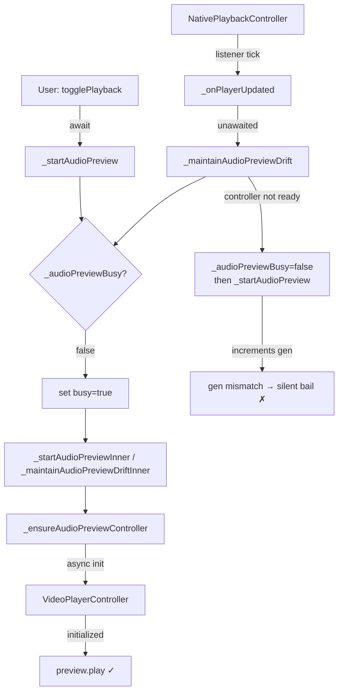
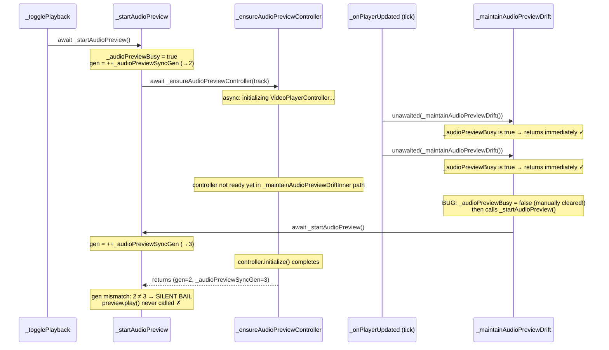

# Design Document: Audio Track Preview Fix

## Overview

Added audio tracks in the `media_studio` example do not play during video preview. The root cause is a race condition between `_startAudioPreview()` (triggered once on play) and `_maintainAudioPreviewDriftInner()` (triggered on every video player tick via `unawaited(_maintainAudioPreviewDrift())`). The drift maintenance path clears the `_audioPreviewBusy` flag and re-enters `_startAudioPreview`, which increments `_audioPreviewSyncGen` and causes the original in-flight start to see a generation mismatch and silently bail out before ever calling `preview.play()`.

---

## Architecture

### Component Diagram



### State Variables

| Variable | Type | Purpose |
|---|---|---|
| `_audioPreview` | `VideoPlayerController?` | The active audio controller |
| `_audioPreviewSyncGen` | `int` | Generation counter; incremented by `_stopAudioPreview` to cancel in-flight ops |
| `_audioPreviewBusy` | `bool` | Reentrancy guard shared by both start and drift paths |
| `_audioStartInFlight` | `bool` | **NEW** — true while `_startAudioPreviewInner` is executing |
| `_lastAudioDriftCorrectionMs` | `int` | Timestamp of last corrective seek (debounce) |

---

## Race Condition Flow Diagram



### Why the Bug Triggers

1. `_togglePlayback` calls `await _startAudioPreview()` → sets `_audioPreviewBusy = true`, increments gen to 2.
2. `_startAudioPreviewInner` calls `await _ensureAudioPreviewController(track)` — this is async and takes ~100–500ms to initialize `VideoPlayerController`.
3. Meanwhile, `_onPlayerUpdated` fires on every native player tick (~16ms). Each tick calls `unawaited(_maintainAudioPreviewDrift())`.
4. The first several ticks are correctly blocked by `_audioPreviewBusy = true`.
5. **The bug**: `_maintainAudioPreviewDriftInner` has a code path that manually sets `_audioPreviewBusy = false` before calling `_startAudioPreview()`. This path is reached when the controller isn't ready yet (which it isn't — it's still initializing).
6. Once `_audioPreviewBusy` is cleared, the next drift tick enters `_startAudioPreview`, increments gen to 3, and starts its own initialization.
7. When the original `_ensureAudioPreviewController` finally returns, the gen-check `2 != 3` fires and the function returns without calling `preview.play()`.

---

## Fix Strategy

The fix ensures `_startAudioPreview` is only triggered once per play action. The drift maintenance path must not interfere with an in-flight start. Three targeted changes accomplish this:

---

## Low-Level Design

### Fix 1: Add `_audioStartInFlight` flag

Add a dedicated boolean to distinguish "busy doing initial start" from "busy doing drift correction". This lets `_maintainAudioPreviewDriftInner` detect that a start is already in progress and skip its re-entry attempt.

**New state variable** (alongside existing `_audioPreviewBusy`):

```dart
bool _audioPreviewBusy = false;
bool _audioStartInFlight = false;  // true while _startAudioPreviewInner is executing
```

**Updated `_startAudioPreview`**:

```dart
Future<void> _startAudioPreview() async {
  if (_audioPreviewBusy) return;
  _audioPreviewBusy = true;
  _audioStartInFlight = true;   // mark: initial start in progress
  try {
    await _startAudioPreviewInner();
  } finally {
    _audioPreviewBusy = false;
    _audioStartInFlight = false; // clear when done
  }
}
```

### Fix 2: Guard drift path against in-flight start

In `_maintainAudioPreviewDriftInner`, replace the problematic block that manually clears `_audioPreviewBusy` and re-enters `_startAudioPreview`:

**Before (buggy)**:

```dart
if (preview == null ||
    !_isSamePath(preview.dataSource, track.sourcePath) ||
    !preview.value.isInitialized) {
  _audioPreviewBusy = false; // allow inner _startAudioPreview to run
  await _startAudioPreview();
  return;
}
```

**After (fixed)**:

```dart
if (preview == null ||
    !_isSamePath(preview.dataSource, track.sourcePath) ||
    !preview.value.isInitialized) {
  if (_audioStartInFlight) return; // don't race with in-flight start
  // No start in flight — safe to trigger one now (e.g. controller was
  // disposed externally or track changed while paused then resumed).
  _audioPreviewBusy = false;
  await _startAudioPreview();
  return;
}
```

This means:
- If `_startAudioPreview` is already running (controller initializing), drift ticks that reach this branch simply return. The original start will complete and call `preview.play()`.
- If no start is in flight (e.g. the controller was disposed externally), the existing fallback behavior is preserved.

### Fix 3: Correct `dispose()` call

The current `dispose()` calls `_stopAudioPreview()` as a fire-and-forget void call, which silently discards the `Future`. This should use `unawaited()` to make the intent explicit and avoid potential analyzer warnings.

**Before**:

```dart
@override
void dispose() {
  _progressSub?.cancel();
  _timeline.removeListener(_onTimelineUpdated);
  _playheadNotifier.dispose();
  _stopAudioPreview();   // fire-and-forget, Future discarded silently
  _tearDownPlayer();
  super.dispose();
}
```

**After**:

```dart
@override
void dispose() {
  _progressSub?.cancel();
  _timeline.removeListener(_onTimelineUpdated);
  _playheadNotifier.dispose();
  unawaited(_stopAudioPreview());  // explicit fire-and-forget
  _tearDownPlayer();
  super.dispose();
}
```

---

## Correctness Properties

### Property 1: Audio always plays when conditions are met

When `_startAudioPreview()` is called and all of the following hold:
- `player != null`
- `player.isPlaying == true`
- A non-muted audio track exists in the timeline
- The playhead is within the audio track's time range

Then `preview.play()` MUST eventually be called. The gen-check must not fire due to concurrent drift maintenance incrementing the gen.

**Invariant**: `_audioPreviewSyncGen` is only incremented by `_stopAudioPreview()`. It must not be incremented by `_maintainAudioPreviewDrift()` or any path called from it.

**Validates: Requirements 1.1, 2.5, 2.6**

### Property 2: At most one audio controller initialization in flight

At any point in time, at most one call to `_ensureAudioPreviewController` is executing. This is guaranteed by `_audioPreviewBusy` being set before entering `_startAudioPreviewInner` and cleared only in the `finally` block.

**Invariant**: `_audioPreviewBusy == true` implies exactly one of `_startAudioPreviewInner` or `_maintainAudioPreviewDriftInner` is currently executing.

**Validates: Requirements 1.2, 1.3, 2.1, 2.2**

### Property 3: Drift maintenance does not increment `_audioPreviewSyncGen`

`_maintainAudioPreviewDrift` and `_maintainAudioPreviewDriftInner` must never call `_stopAudioPreview()` or `++_audioPreviewSyncGen` directly. The only path that may increment the gen from within drift maintenance is via `_startAudioPreview()`, and only when `_audioStartInFlight == false`.

**Validates: Requirements 2.3, 2.5**

### Property 4: `_audioStartInFlight` accurately reflects execution state

`_audioStartInFlight` is `true` if and only if `_startAudioPreviewInner` is currently on the call stack. It is set to `true` before the call and cleared in the `finally` block, so it cannot be left `true` after an exception or early return.

**Validates: Requirements 2.1, 2.2, 2.3**

---

## Error Handling

### Controller initialization failure

`_ensureAudioPreviewController` already handles `controller.initialize()` throwing by disposing the controller and setting `_audioPreview = null`. The gen-check after initialization ensures a stale controller is never used.

### Track removed during initialization

If the audio track is removed from the timeline while `_ensureAudioPreviewController` is awaiting, `_stopAudioPreview()` will be called by `_onTimelineUpdated` (indirectly via `_togglePlayback` or explicit removal), incrementing the gen. The gen-check in `_startAudioPreviewInner` will catch this and bail cleanly.

### Player disposed during initialization

`_tearDownPlayer` sets `_player = null`. The guard `if (player == null || track == null || !player.isPlaying)` at the top of `_startAudioPreviewInner` uses the locally captured `player` reference, so it won't crash. The gen-check provides a secondary safety net.

---

## Testing Strategy

### Manual verification

1. Add an audio track via the "Add Audio" button.
2. Press play.
3. Confirm the log line `[AudioPreview] ▶ playing at Xms` appears within ~1 second.
4. Confirm audio is audible during playback.
5. Pause and resume — audio should restart correctly.
6. Seek to a different position, then play — audio should start at the correct offset.

### Regression checks

- Removing an audio track while playing should stop audio cleanly (no crash, no zombie controller).
- Muting an audio track while playing should silence it without restarting.
- Adding a second audio track while playing should not cause a crash (only the first non-muted track is previewed).
- Rapid play/pause toggling should not leave `_audioPreviewBusy` stuck at `true`.

### Key log lines to verify

| Log line | Meaning |
|---|---|
| `[AudioPreview] _startAudioPreview: hasPlayer=true, track=..., isPlaying=true` | Guard passed |
| `[AudioPreview] controller ready for ...` | Controller initialized successfully |
| `[AudioPreview] ▶ playing at Xms` | `preview.play()` was called — **this must appear** |
| `[AudioPreview] gen mismatch after ensure: X vs Y` | Race condition — must NOT appear after fix |

---

## Dependencies

- `video_player` Flutter package — used for `VideoPlayerController` to play the audio file.
- `NativePlaybackController` (from `video_forge_kit`) — the primary video player whose listener triggers drift maintenance.
- `TimelineController` — manages audio clips and fires `_onTimelineUpdated` on any timeline change.
- `dart:async` `unawaited()` — used for fire-and-forget calls from synchronous contexts.

---

## Known Limitations and Future Work

### Known Limitation: `VideoPlayerController` is heavyweight for audio-only playback

The current implementation reuses `VideoPlayerController` (from the `video_player` package) to play audio tracks. This works but carries unnecessary overhead:

- **Slow startup** — `VideoPlayerController.initialize()` spins up a full video pipeline (decoder, surface, renderer) even for audio-only files. This is the primary reason the race condition window is wide (~100–500ms), making the bug easy to trigger.
- **Higher memory** — a video backend is allocated even when no video frames are decoded.
- **Seeking latency** — video-oriented seek implementations are less precise for audio-only use cases.
- **Backend conflicts** — on some platforms, holding two `VideoPlayerController` instances simultaneously (one for video, one for audio) can cause resource contention.

**Recommended migration (post-MVP):** Replace `VideoPlayerController` for audio preview with a dedicated audio player:

| Option | Notes |
|---|---|
| [`just_audio`](https://pub.dev/packages/just_audio) | Lightweight, fast startup, precise seeking, supports gapless playback and ducking. Preferred. |
| Native audio player (AVAudioPlayer on iOS/macOS, ExoPlayer audio-only on Android) | Maximum performance, but requires platform channel work. |

The migration would replace `_audioPreview: VideoPlayerController?` with an `AudioPlayer` (or equivalent) and update `_ensureAudioPreviewController`, `_startAudioPreviewInner`, `_maintainAudioPreviewDriftInner`, and `_stopAudioPreview` accordingly. The gen-counter and `_audioStartInFlight` guard logic remain valid regardless of the underlying player.

**This fix is acceptable for MVP.** The race condition is eliminated by the `_audioStartInFlight` guard. The heavyweight controller is a performance concern, not a correctness one.

---

### Future Architecture: `AudioPreviewRuntime` for multi-track support

The current architecture manages a single `VideoPlayerController?` as flat state on `_VideoCreatorFlowState`. This breaks down if the product later supports:

- **Multiple simultaneous audio tracks** (e.g. background music + voiceover)
- **Overlapping clips** on the audio timeline
- **Volume ducking** (lower music when voiceover plays)
- **Per-track effects** (fade in/out, EQ)

**Recommended future abstraction: `AudioPreviewRuntime`**

Extract all audio preview state and logic into a dedicated class:

```dart
/// Manages one or more audio track controllers for timeline preview.
/// Owns the lifecycle of all audio players, sync-gen counters, and
/// drift correction. Exposes a simple play/pause/seek/stop interface
/// to VideoCreatorFlowState.
class AudioPreviewRuntime {
  /// Start or resume all active (non-muted) tracks at the given timeline position.
  Future<void> play(int timelineMs, List<AudioTimelineClip> clips);

  /// Pause all active tracks.
  Future<void> pause();

  /// Seek all active tracks to the given timeline position without starting playback.
  Future<void> seekTo(int timelineMs, List<AudioTimelineClip> clips);

  /// Called on every player tick to correct A/V drift across all tracks.
  Future<void> maintainDrift(int timelineMs, List<AudioTimelineClip> clips);

  /// Stop all tracks and release all controllers.
  Future<void> stop();

  /// Release all resources. Safe to call from dispose().
  void dispose();
}
```

`_VideoCreatorFlowState` would hold a single `AudioPreviewRuntime _audioRuntime` instead of the current flat fields (`_audioPreview`, `_audioPreviewSyncGen`, `_audioPreviewBusy`, `_audioStartInFlight`, `_lastAudioDriftCorrectionMs`). The runtime internally manages a `Map<String, AudioPlayer>` keyed by clip ID, with per-player gen counters.

**This refactor is not needed now.** The single-track flat-state model is sufficient for the current feature set. Document this here so the migration path is clear when multi-track support is added.
